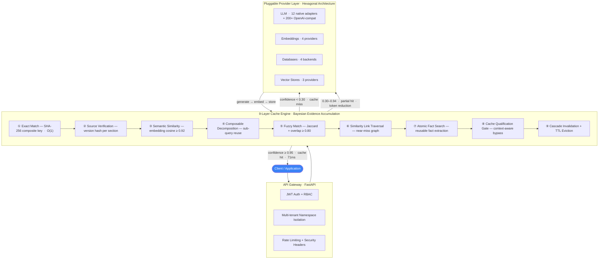

# BitMod — AI Inference Cache & Semantic Reuse Engine

[](https://github.com/DeepanjayNandal/BitMod--AI-Inference-Cache-Semantic-Reuse-Engine/actions/workflows/ci.yml)
[](https://python.org)
[](https://github.com/astral-sh/ruff)

> **Compute once, serve forever.** BitMod sits between your application and any LLM provider, intercepting queries and serving semantically equivalent ones from cache — cutting response latency and API costs without changing a line of application code.

---

## Benchmark Results

Two scenarios measured — local Ollama (no API cost) and remote LLM (GPT-4o / Claude):

| Scenario | Cache Hit Rate | Cached Latency | LLM Latency | Speedup |
|---|---|---|---|---|
| Local — Ollama llama3.2 | 50.7% | ~0ms | 500ms+ | >500× |
| Remote — GPT-4o / Claude | **94%** | **71ms avg** | **12.5s avg** | **176×** |

The gap between the two scenarios reflects query repetition patterns. Remote LLM benchmarks run with high-repetition prompt sets (legal Q&A, support tickets, code review) — exactly the workloads where caching pays off most.

---

## System Design



**Three possible outcomes for every query:**
- **Cache hit** (confidence ≥ 0.95) — response served immediately, no LLM call
- **Partial hit** (0.30–0.94) — cached context injected into a reduced LLM prompt, cutting token usage 50–80%
- **Cache miss** (< 0.30) — full LLM generation, result stored for future reuse

---

## How the Cache Engine Works

Bitmod uses **Bayesian evidence accumulation** — each layer contributes a confidence score `[0, 1]`, composed as:

```
total_confidence = 1 - ∏(1 - cᵢ)
```

This is not winner-take-all. A semantic match at 0.88 plus a fuzzy match at 0.72 combine to a higher confidence than either alone. Negative evidence (stale source hashes, context-dependent query signals) subtracts from the score.

### Cache Layer Breakdown

| Layer | Method | Threshold | Notes |
|---|---|---|---|
| ① Query Normalization | Lowercase + stopword removal + SHA-256 | Always runs | Composite key includes namespace, filters, role |
| ② Exact Match | Key lookup against normalized composite | O(1) | First and fastest check |
| ③ Source Verification | SHA-256 hash per source section | Any mismatch → invalidate | Prevents serving stale answers when documents change |
| ④ Semantic Similarity | Cosine similarity on query embeddings | ≥ 0.92 direct serve / ≥ 0.75 context | Catches rephrased questions with same meaning |
| ⑤ Composable Decomposition | Sub-query splitting + partial reassembly | Any sub-hit counts | "Compare X vs Y" reuses cached X and Y independently |
| ⑥ Fuzzy Match | Jaccard + token overlap similarity | ≥ 0.85 | Catches typos and minor rephrasing |
| ⑦ Similarity Link Traversal | 2-hop near-miss graph (bidirectional) | Configurable strength | Walks related queries learned across sessions |
| ⑧ Atomic Fact Search | Embedding search over extracted facts | ≥ 0.80 similarity | Reuses sub-facts from prior answers without full regeneration |
| ⑨ Session Context | Prior turn injection from session tracker | turn_count > 0 | Injects conversation history as partial cache evidence |

**Supporting mechanisms (not lookup layers):**

- **Cache Qualification Gate** — runs before serving from layers ② and ⑤, detects context-dependent queries ("tell me more", pronoun-heavy follow-ups) and routes them to the LLM instead
- **Cascade Invalidation + TTL** — maintenance layer; source changes propagate invalidation to all dependent cached answers; cost-aware LRU eviction prioritises keeping expensive-to-regenerate entries

### Source-Version Locking

Every cached answer is bound to the SHA-256 hash of each source section it was generated from. Before serving:

```
for each section in answer.source_manifest:
    if db.get(section.id).version_hash != manifest.hash:
        invalidate(answer)
        queue_for_regeneration(query)
```

This ensures answers never go stale when documents are updated.

---

## Architecture

```
┌──────────────────────────────────────────────────────────────┐
│                    Next.js Frontend                           │
│          Admin Dashboard · Cache Stats · Playground           │
└───────────────────────────┬──────────────────────────────────┘
                            │
┌───────────────────────────▼──────────────────────────────────┐
│                      API Gateway                              │
│      FastAPI · JWT/RBAC Auth · Rate Limiting · CORS           │
│      Ingest · Chat · Search · Metrics · Namespace APIs        │
└───────────────────────────┬──────────────────────────────────┘
                            │
┌───────────────────────────▼──────────────────────────────────┐
│                      Chat Service                             │
│    9-Layer Cache · Evidence Accumulation · Intent Detection   │
│    SSE Streaming · Tool Calling · Session Management          │
└───┬──────────┬────────────┬─────────────┬────────────────────┘
    │          │            │             │
┌───▼──┐  ┌───▼──────┐ ┌───▼───┐  ┌─────▼──────┐
│ LLM  │  │Embeddings│ │  DB   │  │Vector Store│
│200+  │  │4 provs   │ │4 backs│  │3 providers │
└──────┘  └──────────┘ └───────┘  └────────────┘
    │
┌───▼────────────────┐
│   Reverse Proxy    │
│ OpenAI · Anthropic │
│ · Gemini format    │
└────────────────────┘
```

**Design decision — hexagonal architecture:** All external dependencies (LLM, database, embeddings, vector stores, messaging) sit behind typed abstract interfaces. Swapping from SQLite to PostgreSQL or from OpenAI to Anthropic is a one-line config change, not a code change. This is enforced via `core/bitmod/interfaces/` and 29 concrete adapter implementations.

---

## Tech Stack

| Layer | Technology |
|---|---|
| Core library | Python 3.10+, fully typed (mypy strict) |
| API services | FastAPI, SSE streaming, Pydantic v2 |
| Frontend | Next.js 15, React 19, Tailwind v4, shadcn/ui |
| Default database | SQLite with FTS5 + cosine similarity |
| Production database | PostgreSQL + pgvector |
| Vector search | Qdrant (prod) · Chroma (dev) · Pinecone (cloud) |
| Embeddings | Ollama nomic-embed-text · OpenAI · Cohere · local sentence-transformers |
| Containerization | Docker, multi-stage builds, Docker Compose (3 profiles) |
| Kubernetes | Helm charts with auto-scaling, PDBs, NetworkPolicies |
| CI/CD | GitHub Actions — 7 jobs: lint, typecheck, test (3.11/3.12/3.13), build, frontend, security |
| Security scanning | gitleaks, pip-audit, semgrep |
| Observability | structlog, OpenTelemetry hooks, Prometheus metrics, Grafana dashboards |
| Package tooling | hatchling, ruff, pre-commit |

---

## Quickstart

### Option A: pip install

```bash
pip install bitmod
bitmod init          # interactive setup — detects your LLM, embeddings, database
bitmod ingest ./docs/
bitmod query "What is our refund policy?"
```

### Option B: Docker (one command)

```bash
git clone https://github.com/DeepanjayNandal/BitMod--AI-Inference-Cache-Semantic-Reuse-Engine.git
cd BitMod--AI-Inference-Cache-Semantic-Reuse-Engine

docker compose up                                    # SQLite + FastAPI (default)
docker compose --profile ollama up                   # + local Ollama (no API keys)
docker compose --profile postgres up                 # + PostgreSQL + pgvector
```

### Option C: Python library

```python
from bitmod import Bitmod

bm = Bitmod()
bm.ingest("./reports/")

result = bm.query("What was Q3 revenue?")
print(result.answer)          # The answer
print(result.cached)          # True if served from cache
print(result.sources)         # Source citations
print(result.generation_ms)   # 0ms if cached
```

### Configuration

```bash
# Works with any OpenAI-compatible provider (Groq, Together, vLLM, LM Studio, ...)
export BITMOD_LLM_URL=https://api.groq.com/openai/v1
export BITMOD_LLM_API_KEY=your-key
export BITMOD_LLM_MODEL=llama-3.3-70b
```

Or via `bitmod.yaml`:

```yaml
llm_url: http://localhost:11434/v1
llm_model: llama3.2
embedding_provider: ollama
embedding_model: nomic-embed-text
db_backend: sqlite      # postgresql | mysql | mongodb
```

---

## Supported Providers

### LLM

| Provider | Key | Notes |
|---|---|---|
| **Any OpenAI-compatible** | `BITMOD_LLM_API_KEY` | Groq, Together, Fireworks, vLLM, LM Studio, Jan.ai, 200+ |
| Ollama | none | llama3.2, mistral, phi3, gemma2 — fully local |
| Anthropic | `ANTHROPIC_API_KEY` | claude-sonnet-4, claude-haiku |
| OpenAI | `OPENAI_API_KEY` | gpt-4o, gpt-4o-mini |
| Gemini | `GEMINI_API_KEY` | gemini-2.0-flash |
| xAI | `XAI_API_KEY` | grok-3 |
| Mistral | `MISTRAL_API_KEY` | mistral-large |
| Perplexity | `PERPLEXITY_API_KEY` | sonar-pro |
| OpenRouter | `OPENROUTER_API_KEY` | unified gateway |
| HuggingFace | `HF_API_KEY` | inference API |
| AWS Bedrock | IAM credentials | Claude, Titan, Llama |
| Azure OpenAI | `AZURE_OPENAI_API_KEY` | GPT-4o via Azure |

### Databases

| Backend | Search | Best for |
|---|---|---|
| SQLite | FTS5 + cosine | Development, single-node, zero config |
| PostgreSQL | BM25 + pgvector | Production |
| MySQL | FULLTEXT + approximate | Existing MySQL infrastructure |
| MongoDB | Atlas Search | Document-heavy workloads |

### Embeddings · Vector Stores · Messaging

| Embeddings | Vector Stores | Messaging |
|---|---|---|
| Ollama nomic-embed-text (768d) | Qdrant (production) | Slack |
| Local all-MiniLM-L6-v2 (384d) | Chroma (development) | Discord |
| OpenAI text-embedding-3-small (1536d) | Pinecone (managed cloud) | Telegram |
| Cohere embed-v4.0 (1024d) | | Matrix |
| | | WhatsApp Business |

---

## API Reference

```bash
# Ingest
curl -X POST http://localhost:8000/v1/ingest/text \
  -H "Content-Type: application/json" \
  -d '{"text": "Your content...", "title": "My Doc"}'

curl -X POST http://localhost:8000/v1/ingest/file \
  -F "file=@report.pdf"

# Query
curl -X POST http://localhost:8000/v1/chat \
  -H "Content-Type: application/json" \
  -d '{"message": "What are the key findings?", "stream": false}'

# Observability
curl http://localhost:8000/v1/cache/stats
curl http://localhost:8000/v1/admin/metrics
```

---

## CLI

```
bitmod init                       Interactive setup wizard
bitmod init --auto                Zero-config (Ollama + SQLite)
bitmod ingest <path>              Ingest file or directory
bitmod query "question"           Query with cache stats output
bitmod serve                      Start API server
bitmod proxy                      Start reverse proxy mode
bitmod cache stats                Hit rates, latency, token savings
bitmod cache search "term"        Search the cache
bitmod doctor                     Health check all dependencies
bitmod backup create              Snapshot current state
bitmod migrate                    Run database migrations
bitmod --format json status | jq  JSON output for scripting
```

---

## Project Structure

```
bitmod/
├── core/bitmod/          # Core library — pip install bitmod
│   ├── cache_engine.py   # 9-layer cache with Bayesian accumulation
│   ├── cache_qualify.py  # Cache qualification gate
│   ├── intent.py         # Intent detection engine
│   ├── api.py            # Bitmod() class — ingest, query, status
│   ├── cli.py            # Full CLI with JSON output + completions
│   ├── auth.py           # JWT authentication
│   ├── namespaces.py     # Multi-tenant isolation
│   ├── migrations.py     # Schema migration runner
│   ├── adapters/         # 29 provider adapters
│   ├── interfaces/       # Abstract base classes (hexagonal architecture)
│   ├── ingestion/        # Document parser + chunker + pipeline
│   └── proxy/            # Reverse proxy (OpenAI / Anthropic / Gemini format)
├── services/
│   ├── gateway/          # API gateway — FastAPI
│   ├── chat/             # Chat service — FastAPI + SSE streaming
│   └── frontend/         # Admin dashboard — Next.js 15, React 19, Tailwind v4
├── sdk/python/           # Python SDK (bitmod-client)
├── db/migrations/        # 11 versioned database migrations
├── deploy/               # Helm charts, Docker Compose, Grafana dashboards
├── docs/                 # Architecture docs, ADRs, security runbooks
└── tests/                # 54 test modules, 1000+ test functions
```

---

## Trade-offs & Design Decisions

**Why SQLite as default?** Zero dependencies, works everywhere, ships the product on first `pip install`. PostgreSQL + pgvector is one config line away for production. See [ADR 002](docs/adr/002-sqlite-default-backend.md).

**Why hexagonal architecture?** Provider lock-in is real. Swapping LLMs, databases, or vector stores should be configuration, not refactoring. See [ADR 001](docs/adr/001-hexagonal-architecture.md).

**Why Bayesian scoring over a single threshold?** A fuzzy match at 0.78 and a semantic match at 0.88 together are more reliable than either alone. Multiplicative composition prevents false confidence from a single weak signal.

**What this doesn't do:** BitMod is a cache and retrieval layer, not an agent framework or RAG pipeline replacement. It works best for high-repetition query workloads — support, legal, HR, documentation Q&A.

---

## License

© 2026 Deepanjay Nandal. All rights reserved.
